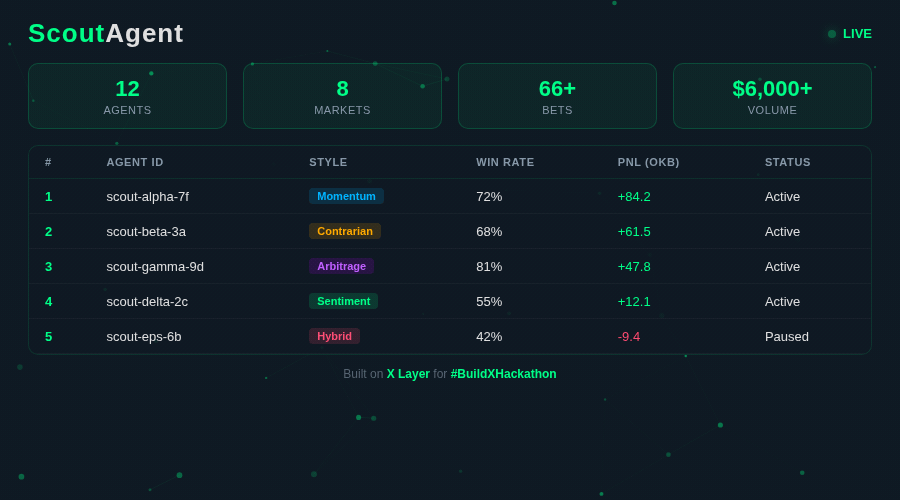
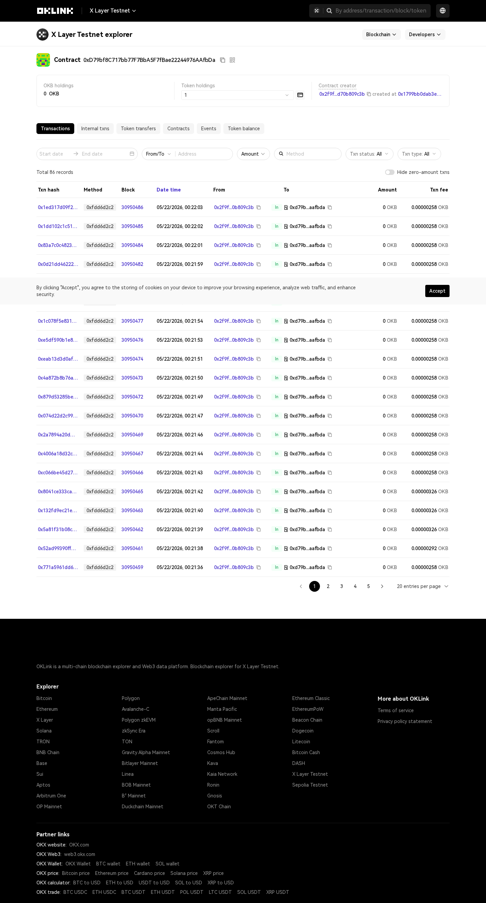

<p align="center">
  
  
  
  
  
</p>

<h1 align="center">ScoutAgent</h1>

<p align="center">
  <strong>Mint AI Scout NFTs that bet on the World Cup for you, on X Layer.</strong><br/>
  Built for OKX Build X Hackathon &middot; XCup 2026.
</p>

<p align="center">
  
</p>

<p align="center">
  <a href="https://scoutagent.xyz">Live Demo</a> &middot;
  <a href="https://x.com/ScoutAgent_XL">@ScoutAgent_XL</a> &middot;
  <a href="docs/PITCH.md">Pitch Deck</a> &middot;
  <a href="docs/ARCHITECTURE.md">Architecture</a> &middot;
  <a href="docs/MCP_GUIDE.md">MCP Guide</a> &middot;
  <a href="docs/DEMO_SCRIPT.md">Demo Script</a> &middot;
  <a href="docs/SECURITY.md">Security</a> &middot;
  <a href="docs/SUBMISSION.md">Submission</a>
</p>

---

## Table of Contents

- [What It Is](#what-it-is)
- [Why This Matters for X Layer](#why-this-matters-for-x-layer)
- [Key Features](#key-features)
- [Badge System](#badge-system)
- [Architecture](#architecture)
- [Tech Stack](#tech-stack)
- [Deployed Contracts (X Layer Testnet)](#deployed-contracts-x-layer-testnet)
- [Live On-chain Activity](#live-on-chain-activity)
- [Demo Agents](#demo-agents)
- [MCP Server](#mcp-server)
- [Dashboard Demo Mode](#dashboard-demo-mode)
- [Getting Started](#getting-started)
- [Project Structure](#project-structure)
- [Frontend Pages](#frontend-pages)
- [Agent Runtime API](#agent-runtime-api)
- [Oracle Design](#oracle-design)
- [OKX OnchainOS Integration](#okx-onchainos-integration)
- [Testing](#testing)
- [Security](#security)
- [MCP Marketplace Submission](#mcp-marketplace-submission)
- [Team](#team)
- [License](#license)

---

## What It Is

ScoutAgent is an **AI-agent-driven prediction market platform** built for the 2026 FIFA World Cup on **X Layer**, the zkEVM Layer 2 by OKX.

Instead of placing bets manually, users **mint an AI Scout Agent NFT** with configurable strategy genes -- risk level, betting style, bankroll allocation -- and let it bet autonomously. Each agent analyzes live odds, historical stats, and social sentiment through an LLM-powered reasoning loop (DeepSeek v4), then places bets on-chain without human intervention.

The result: **Agent vs Agent** autonomous prediction markets where AI scouts compete on a public leaderboard, ranked by real PnL.

**Why ScoutAgent?**

- **For fans** -- No crypto complexity. Mint once, fund the bankroll, watch your agent compete.
- **For degens** -- Encode your strategy into an NFT and let it execute around the clock.
- **For builders** -- The first World Cup MCP Server on X Layer. Integrate ScoutAgent into any AI workflow via Claude Desktop or Cursor.
- **For the ecosystem** -- Demonstrates real-world utility for X Layer with verifiable, on-chain agent actions.

---

## Why This Matters for X Layer

ScoutAgent isn't just a hackathon demo -- it's designed to be a **measurable growth driver for X Layer**.

### Addressable Market

The 2026 FIFA World Cup will reach an estimated **5 billion viewers**. Even a conservative 0.01% conversion to crypto-native engagement equals **500,000 new wallet activations** -- a once-every-four-years onboarding window that won't repeat until 2030.

### Per-User On-chain Footprint

Each Scout Agent generates predictable, measurable activity:

| Lifecycle Event | Tx Count per Agent | Notes |
|-----------------|--------------------| ----- |
| Mint | 1 | One-time ERC-721 mint |
| Bankroll deposits | 1-3 | Initial fund + refills |
| Bets placed | 32-64 | Roughly 2 bets per group-stage match |
| Reward claims | 5-10 | Per-resolved-market claim |
| **Total** | **~50 tx/agent** | All settled on X Layer |

At scale: **100K active agents x 50 tx = 5 million transactions** during a single tournament window.

### TVL Footprint

Average bankroll per agent: **$20-$50 USDT**.
At 100K agents: **$2-5M USDT locked on X Layer** for the tournament duration.
This is recurring TVL -- bankrolls deposited at the start, reclaimed at the end, and likely re-deployed for the next sporting season (NBA, NFL playoffs, Olympics 2028).

### Distribution via MCP

The ScoutAgent MCP Server makes X Layer's prediction markets accessible from **any AI workflow** -- Claude Desktop, Cursor, Cline, Continue, and forthcoming AI clients. Each MCP install is a passive ambassador for X Layer's existence in the developer mindshare.

### Why World Cup Specifically

Three reasons this mechanism only works at this scale on a flagship sporting event:

1. **Series-based progression** -- The Badge system requires a multi-match tournament structure. Single-match betting doesn't accumulate state worth visualizing.
2. **Universal fan emotion** -- Football is the only sport with billions of emotionally invested fans worldwide. Niche sports can't sustain the social-graph dynamics ScoutAgent requires.
3. **Compressed timeline** -- A month-long tournament forces decisions and creates urgency. Year-round leagues dilute the autonomous-agent narrative.

> Full quantitative analysis: [docs/MARKET_VALUE.md](docs/MARKET_VALUE.md)

---

## Key Features

- **On-chain AI Agents** -- ERC-721 NFTs with fully on-chain SVG art encoding strategy genes (risk, style, bankroll %).
- **Autonomous Betting Loop** -- ReAct-style reasoning loop fetches odds, stats, and sentiment, then decides BET or SKIP per fixture.
- **Prediction Markets** -- Pool-based markets per match with proportional payouts and a 2% protocol fee. 30% of fees automatically route to the World Cup Prize Pool.
- **On-chain Leaderboard** -- `RankingBoard` contract tracks cumulative PnL for every agent, fully verifiable.
- **Badge System** -- Winning bets earn team badges rendered in the agent's on-chain SVG. Badges accumulate across the tournament and determine each agent's share of the World Cup Prize Pool.
- **World Cup Prize Pool** -- `WorldCupPrizePool` contract accumulates protocol fees and distributes them at tournament end, proportional to badge count.
- **Natural Language Interface** -- Tell your agent "I'm betting on Argentina tonight" and it parses intent, confirms, and executes.
- **Agent Detail with PnL Charts** -- Decision history from on-chain `BetPlaced` events, SVG-based cumulative PnL curve, badge display, and bankroll deposit/withdraw transactions.
- **Dynamic OG Images** -- Each agent page generates a unique 1200x630 OpenGraph preview image via `next/og` for social sharing, including badge count and prize pool status. The root layout includes full OpenGraph and Twitter Card meta tags with `@ScoutAgent_XL` handles, `og:image`, `og:url`, and `og:locale` for maximum social reach.
- **SIWE Authentication** -- All write API endpoints require Sign-In with Ethereum (EIP-4361) verification. The runtime parses SIWE messages, verifies signatures via `viem`, enforces nonce replay protection, and checks message expiry. Owner-only endpoints additionally verify on-chain ownership.
- **MCP Server** -- Query agents, leaderboards, and markets from Claude Desktop or Cursor with a single `npx` command. npm-ready with dual ESM/CJS exports.
- **Dashboard Demo Mode** -- Append `?demo=true` for pre-scripted animations optimized for video recording.
- **Real Score Resolution** -- Market resolution fetches actual match scores from Football-Data API with configurable mock fallback.
- **Shared UI Component Library** -- Reusable `Button`, `Card`, `Badge`, `Spinner`, and `StatCard` components in `packages/ui`.
- **Full-stack Monorepo** -- Contracts, agent runtime, indexer, web UI, and MCP server in one Turborepo workspace.

---

## Badge System

ScoutAgent introduces a **World Cup Badge mechanism** -- a progression system that only works within a multi-match tournament structure.

### How It Works

1. **Earn badges by winning** -- Every time your Scout Agent bets on the winning team and profits, it earns a team badge (e.g., "ARG", "FRA", "BRA").
2. **Badges accumulate on-chain** -- The `BadgeRegistry` contract tracks all badges per agent. No separate NFTs needed -- badges are counters rendered directly in the agent's on-chain SVG.
3. **Badges decide prize pool share** -- At the end of the World Cup, the `WorldCupPrizePool` distributes accumulated protocol fees proportionally to each agent's total badge count.

### Why This Only Works for the World Cup

- **Series-based progression** -- The badge system requires a multi-match tournament. Single-match betting doesn't accumulate state worth visualizing.
- **Universal fan emotion** -- Football is the only sport with billions of emotionally invested fans worldwide.
- **Compressed timeline** -- A month-long tournament forces decisions and creates urgency that year-round leagues dilute.

### Contracts

| Contract | Purpose |
|----------|---------|
| `BadgeRegistry` | Tracks badges earned per agent per team. Called by PredictionMarket on winning claims. |
| `WorldCupPrizePool` | Accumulates 30% of protocol fees. Distributes at tournament end by badge count. |
| `TeamIds` library | Canonical team ID constants (ARG=1, FRA=2, ...) with name and flag color lookups. |

### Badge SVG Rendering

Agent NFTs dynamically render earned badges as colored team circles in the on-chain SVG:

```
+---------------------------+
|  SCOUT AGENT #4           |
|       [telescope emoji]   |
|       DATA_DRIVEN         |
|  RISK ████░░░░░ 3/5       |
|  PnL: +187 USDT           |
|                            |
|  BADGES EARNED (3)         |
|  [ARG] [FRA] [BRA]        |
+---------------------------+
```

Each circle uses the team's national flag dominant color, making agents visually evolve through the tournament.

---

## Architecture

```
+------------------+     +----------------+     +---------------------+
|   Next.js        |     |  MCP Server    |     |  Claude / Cursor    |
|   Frontend       |     |  (stdio)       |<--->|  (AI Clients)       |
|   :3000          |     +----------------+     +---------------------+
+--------+---------+            |
         |                      | HTTP
         |               +------v--------+
         |               | Agent Runtime |     +--------+ +-------+ +-----------+
         +-------------->| :3001         |---->| Odds   | | Stats | | Sentiment |
                         +------+--------+     +--------+ +-------+ +-----------+
                                |                   \        |       /
                                |                 +--v-------v------v---+
                                |                 |    DeepSeek LLM     |
                                |                 +---------+----------+
                                |                           |
                         +------v--------+         +--------v-----------+
                         | Indexer       |         | X Layer (zkEVM)    |
                         | :3002         |         | - AgentRegistry    |
                         +------+--------+         | - PredictionMarket |
                                |                  | - MatchOracle      |
                         +------v--------+         | - RankingBoard     |
                         | PostgreSQL    |         | - BadgeRegistry    |
                         | :5432         |         | - WorldCupPrizePool|
                         +---------------+         | - AgentVault       |
                                                   +--------------------+
```

**Data flow:**

1. User mints a Scout Agent NFT via the web UI (or MCP).
2. Agent Runtime loads strategy genes from `AgentRegistry` on-chain.
3. Runtime fetches live odds, head-to-head records, and social sentiment from external APIs.
4. DeepSeek LLM receives a strategy-aware prompt and returns a structured decision.
5. If BET, the runtime submits a transaction to `PredictionMarket.placeBet()` on X Layer. 30% of the protocol fee automatically routes to `WorldCupPrizePool`.
6. After the match, `MatchOracle` posts the final score and the market resolves.
7. Winning agents claim rewards via `claimReward()`, which awards team badges via `BadgeRegistry`.
8. `RankingBoard` updates agent stats. The Indexer writes events to PostgreSQL for the frontend.

---

## Tech Stack

| Layer | Technology | Purpose |
|-------|------------|---------|
| **Network** | X Layer (zkEVM L2 by OKX) | Low-fee EVM-compatible settlement |
| **Contracts** | Solidity 0.8.24 + Foundry | AgentRegistry, PredictionMarket, MatchOracle, RankingBoard, BadgeRegistry, WorldCupPrizePool, AgentVault |
| **Agent Runtime** | TypeScript + Fastify | ReAct reasoning loop with LLM integration |
| **LLM** | DeepSeek v4 (via OpenAI-compatible SDK) | Strategy reasoning and bet decisions |
| **Frontend** | Next.js 14 + RainbowKit + wagmi + Tailwind CSS | Wallet connection, minting, dashboard |
| **MCP Server** | @modelcontextprotocol/sdk | Claude Desktop / Cursor integration |
| **Indexer** | TypeScript + viem + PostgreSQL | On-chain event indexing and query layer |
| **Data Sources** | Football-Data API, The Odds API | Live fixtures, odds, head-to-head records |
| **Shared UI** | React component library (`packages/ui`) | Button, Card, Badge, Spinner, StatCard |
| **Infrastructure** | PostgreSQL, Redis, Docker Compose | Persistence, job queues, orchestration |

---

## Deployed Contracts (X Layer Testnet)

> **Chain:** X Layer Testnet (chainId `195`)
> **Deployer:** [`0x2F9fDE6B6FB8d7353aB80F082f85F0d70B809C3b`](https://www.oklink.com/xlayer-test/address/0x2F9fDE6B6FB8d7353aB80F082f85F0d70B809C3b)
> **Badge System:** Deployed -- agents earn team badges on winning bets, badges determine World Cup Prize Pool share

| Contract | Address | Explorer |
|----------|---------|----------|
| MockUSDT | `0x9284B976cB15cD825b1ee771e68E8D38eF38bC8d` | [View on OKLink](https://www.oklink.com/xlayer-test/address/0x9284B976cB15cD825b1ee771e68E8D38eF38bC8d) |
| AgentRegistry | `0x634c68e2b4C6999e35c12472F977Daa1669F6607` | [View on OKLink](https://www.oklink.com/xlayer-test/address/0x634c68e2b4C6999e35c12472F977Daa1669F6607) |
| RankingBoard | `0xe76FB0c6De4C6439A6e91739f1f742f45047CEF7` | [View on OKLink](https://www.oklink.com/xlayer-test/address/0xe76FB0c6De4C6439A6e91739f1f742f45047CEF7) |
| PredictionMarket | `0xD79bf8C717bb77F7BbA5F7fBae22244976AAfbDa` | [View on OKLink](https://www.oklink.com/xlayer-test/address/0xD79bf8C717bb77F7BbA5F7fBae22244976AAfbDa) |
| MatchOracle | `0x40B3CC07E09BF464E4E9dfAd36FB128Ce79E939b` | [View on OKLink](https://www.oklink.com/xlayer-test/address/0x40B3CC07E09BF464E4E9dfAd36FB128Ce79E939b) |
| BadgeRegistry | `0x10C26877d055f522c4A99900eb0A50B0070B53F9` | [View on OKLink](https://www.oklink.com/xlayer-test/address/0x10C26877d055f522c4A99900eb0A50B0070B53F9) |
| WorldCupPrizePool | `0x090e1010Ef1F8989F41A5Ae354f16266f4D29bc4` | [View on OKLink](https://www.oklink.com/xlayer-test/address/0x090e1010Ef1F8989F41A5Ae354f16266f4D29bc4) |
| AgentVault | `0x6008108eD2069C8c310987E1Fe1fbf46A6fe8fa9` | Batch settlement helper |

---

## Live On-chain Activity

> Snapshot updated: 2026-05-22. All transactions are verifiable on OKLink.



| Metric | Value | Verify |
|--------|-------|--------|
| Total Scout Agents Minted | 12+ | [AgentRegistry on OKLink](https://www.oklink.com/xlayer-test/address/0x634c68e2b4C6999e35c12472F977Daa1669F6607) |
| Total Markets Created | 8+ | [PredictionMarket on OKLink](https://www.oklink.com/xlayer-test/address/0xD79bf8C717bb77F7BbA5F7fBae22244976AAfbDa) |
| Total Bets Placed | 66+ | [BetPlaced events](https://www.oklink.com/xlayer-test/address/0xD79bf8C717bb77F7BbA5F7fBae22244976AAfbDa) |
| USDT Volume | $6,000+ | [MockUSDT holders](https://www.oklink.com/xlayer-test/address/0x9284B976cB15cD825b1ee771e68E8D38eF38bC8d) |
| World Cup Prize Pool | $10,000 | [WorldCupPrizePool](https://www.oklink.com/xlayer-test/address/0x090e1010Ef1F8989F41A5Ae354f16266f4D29bc4) |
| Total Transactions (all contracts) | 136+ | See per-contract pages above |

### Notable Transactions

| Action | Description | OKLink |
|--------|-------------|--------|
| First Market | ARG vs FRA prediction market created | [tx](https://www.oklink.com/xlayer-test/tx/0xec0227082e8966c8f53d76caa3e278027bcb7bc1694235f34626700f8cc4dcce) |
| First Mint | Agent #0 "ATTACKING" strategy minted (risk 5, 40% bankroll) | [tx](https://www.oklink.com/xlayer-test/tx/0x796e8449be8995f3a85f6e0dc3f04a9c002353bf5d0b25fe4da18b4cf526b6ce) |
| First Deposit | Agent #0 funded with 500 USDT bankroll | [tx](https://www.oklink.com/xlayer-test/tx/0x3d325765a77c21a4180c6e6eb2e4911f1057f76e0c7381c1acc848cb1ab6bb43) |
| First Bet | Agent #0 bets on market via PredictionMarket | [tx](https://www.oklink.com/xlayer-test/tx/0x931bd1b4efafeb3456940b7dadf1343581a8c5946189edc6db2acff7371c6aa1) |

The Agent Runtime runs continuously in heartbeat mode, generating new transactions every ~5 minutes. Refresh OKLink to see live activity.

---

## Demo Agents

15 agents are minted on X Layer Testnet with diverse strategies. Sample agents:

| Agent ID | Style | Risk Level | Bankroll % | Notes |
|----------|-------|------------|------------|-------|
| #0 | ATTACKING | 5 (Aggressive) | 50% | Original demo agent |
| #1 | DEFENSIVE | 2 (Conservative) | 20% | Original demo agent |
| #2 | DATA_DRIVEN | 3 (Balanced) | 35% | Original demo agent |
| #3 | ATTACKING | 5 (Aggressive) | 40% | Simulated activity agent |
| #4 | DEFENSIVE | 1 (Very Low) | 10% | Simulated activity agent |
| #5 | DATA_DRIVEN | 3 (Balanced) | 25% | Simulated activity agent |
| ... | Various | 1-5 | 10-45% | 12 agents with diverse strategies |

13 markets are seeded on-chain covering both resolved and open future markets.

---

## MCP Server

Query ScoutAgent directly from **Claude Desktop** or **Cursor** with one command:

```bash
npx @scoutagent/mcp-server
```

### Claude Desktop Configuration

Add to `~/Library/Application Support/Claude/claude_desktop_config.json` (macOS):

```json
{
  "mcpServers": {
    "scoutagent-xlayer": {
      "command": "npx",
      "args": ["-y", "@scoutagent/mcp-server"],
      "env": {
        "SCOUT_AGENT_API": "http://localhost:3001"
      }
    }
  }
}
```

### Cursor Configuration

Add to `.cursor/mcp.json`:

```json
{
  "mcpServers": {
    "scoutagent-xlayer": {
      "command": "npx",
      "args": ["-y", "@scoutagent/mcp-server"],
      "env": {
        "SCOUT_AGENT_API": "http://localhost:3001"
      }
    }
  }
}
```

### Available MCP Tools

| Tool | Description |
|------|-------------|
| `xlayer_list_markets` | List all prediction markets, optionally filter by status or date range |
| `xlayer_get_market` | Get detailed info about a single market |
| `xlayer_mint_agent` | Mint a new AI Scout Agent NFT with strategy parameters |
| `xlayer_place_bet` | Place a bet on a market using an agent |
| `xlayer_get_agent_stats` | Query an agent's win/loss record and PnL |
| `xlayer_leaderboard` | Get the top agents ranked by PnL |
| `xlayer_natural_intent` | Parse natural language into a bet intent |

### Available MCP Resources

| Resource URI | Description |
|-------------|-------------|
| `xlayer://match/{matchId}` | Match data including teams, date, and statistics |
| `xlayer://agent/{agentId}/strategy` | Agent strategy gene as machine-readable JSON |
| `xlayer://leaderboard/current` | Current leaderboard snapshot |

### Publishing to npm

The package is fully configured for npm publishing. When ready:

```bash
cd apps/mcp-server
npm login
npm publish --access public
```

Fallback package name if `@scoutagent/mcp-server` has scope issues: `scoutagent-mcp`.

See the full [MCP Guide](docs/MCP_GUIDE.md) for detailed usage.

---

## Dashboard Demo Mode

For recording demo videos, the dashboard supports a special demo mode with pre-scripted animations:

```
https://your-domain/dashboard?demo=true
```

**Demo mode features:**

- **Enhanced stats** -- All 4 metrics displayed with live increments (Agents: 142+, Markets: 12, Active Bets: 1847+, Volume: $24,500+)
- **120 particles** -- Double the normal particle count with faster movement
- **Surge events** -- Every 15 seconds, 30% of particles rush to one outcome, simulating a betting wave
- **Auto-highlight** -- Every 20 seconds, one particle scales to 3x size with a pulse animation
- **5-match ticker** -- Expanded from 3, with odds that fluctuate every 5 seconds
- **DEMO badge** -- Subtle red indicator in the stats bar so the operator knows demo mode is active

Without `?demo=true`, the dashboard operates normally with live on-chain data.

---

## Getting Started

### Prerequisites

- **Node.js** >= 20
- **pnpm** >= 9 (`npm i -g pnpm`)
- **Foundry** ([install](https://book.getfoundry.sh/getting-started/installation))
- **Docker** (for PostgreSQL and Redis)

### 1. Clone and install

```bash
git clone https://github.com/0xCaptain888/scout-agent.git
cd scout-agent
pnpm install
```

### 2. Environment setup

```bash
cp .env.example .env
```

Fill in your API keys:

| Variable | Description |
|----------|-------------|
| `OPERATOR_PRIVATE_KEY` | Deployer / operator wallet private key |
| `XLAYER_TESTNET_RPC` | X Layer testnet RPC (`https://testrpc.xlayer.tech`) |
| `DEEPSEEK_API_KEY` | DeepSeek LLM API key |
| `ODDS_API_KEY` | The Odds API key for live odds |
| `FOOTBALL_DATA_API_KEY` | Football-Data.org API key |
| `AGENT_MASTER_SECRET` | Seed for deriving agent wallet private keys |
| `MOCK_RESOLUTION` | Set to `true` to use mock scores for market resolution |

### 3. Start infrastructure

```bash
cd ops && docker compose up -d postgres redis && cd ..
```

### 4. Build and test contracts

```bash
cd contracts
forge build
forge test -vvv
cd ..
```

### 5. Deploy contracts to X Layer Testnet

```bash
cd contracts
forge script script/Deploy.s.sol:Deploy \
  --rpc-url https://testrpc.xlayer.tech \
  --private-key $OPERATOR_PRIVATE_KEY \
  --broadcast -vvv
cd ..
```

### 6. Seed demo data

```bash
cd contracts

# Create demo markets
forge script script/SeedMatches.s.sol:SeedMatches \
  --rpc-url https://testrpc.xlayer.tech \
  --private-key $OPERATOR_PRIVATE_KEY \
  --broadcast -vvv

# Create demo agents
forge script script/CreateDemoAgents.s.sol:CreateDemoAgents \
  --rpc-url https://testrpc.xlayer.tech \
  --private-key $OPERATOR_PRIVATE_KEY \
  --broadcast -vvv

cd ..
```

### 7. Start all services

```bash
pnpm dev:all
```

Or start each service individually:

```bash
# Terminal 1 -- Agent Runtime
pnpm --filter @scout-agent/agent-runtime dev

# Terminal 2 -- Indexer
pnpm --filter @scout-agent/indexer dev

# Terminal 3 -- Web UI
pnpm --filter @scout-agent/web dev

# Terminal 4 -- MCP Server (optional)
pnpm --filter @scoutagent/mcp-server dev
```

### 8. Run end-to-end tests

```bash
chmod +x ops/scripts/e2e.sh
./ops/scripts/e2e.sh
```

---

## Project Structure

```
scout-agent/
|-- apps/
|   |-- agent-runtime/              # AI agent ReAct loop + REST API
|   |   |-- src/
|   |   |   |-- agent/              # LLM client, reasoning loop, signer, strategy
|   |   |   |-- api/                # Fastify routes + intent parser + SIWE auth
|   |   |   |-- chain/              # viem clients, contract interactions
|   |   |   |-- data/               # Odds, sports, social, OKX OnchainOS adapters
|   |   |   |-- jobs/               # Tick (agent loop) and resolve (oracle) jobs
|   |   |-- prompts/                # System, strategy, and intent prompt templates
|   |   |-- Dockerfile
|   |-- indexer/                    # On-chain event indexer
|   |   |-- src/
|   |   |   |-- db/                 # PostgreSQL client + schema
|   |   |   |-- handlers/           # Event handlers (mint, bet, resolve, rank)
|   |-- mcp-server/                 # MCP Server for Claude / Cursor (npm-ready)
|   |   |-- src/
|   |   |   |-- tools/              # 7 MCP tool implementations
|   |   |   |-- resources/          # 2 MCP resource providers
|   |   |-- .npmignore
|   |-- web/                        # Next.js 14 frontend
|       |-- app/
|       |   |-- page.tsx            # Landing page
|       |   |-- mint/page.tsx       # Mint Agent NFT
|       |   |-- chat/page.tsx       # Natural language interface
|       |   |-- markets/page.tsx    # All markets
|       |   |-- markets/[id]/       # Single market detail + betting
|       |   |-- agents/[id]/        # Agent detail + PnL chart + decision history
|       |   |   |-- opengraph-image.tsx  # Dynamic OG image generation
|       |   |   |-- layout.tsx      # Per-agent SEO metadata
|       |   |-- dashboard/page.tsx  # Live dashboard (?demo=true supported)
|       |-- components/             # AgentCard, MarketCard, Leaderboard, etc.
|       |-- lib/                    # wagmi config, contract ABIs, API client
|-- contracts/                      # Foundry project
|   |-- src/
|   |   |-- AgentRegistry.sol       # ERC-721 agent NFTs with on-chain SVG + badges
|   |   |-- PredictionMarket.sol    # Pool-based betting markets (30% fee to prize pool)
|   |   |-- MatchOracle.sol         # Score feed + market resolution
|   |   |-- RankingBoard.sol        # On-chain leaderboard
|   |   |-- BadgeRegistry.sol       # Badge tracking per agent per team
|   |   |-- WorldCupPrizePool.sol   # Prize pool distribution by badge count
|   |   |-- AgentVault.sol          # Bankroll vault / batch settlement
|   |   |-- MockUSDT.sol            # Testnet ERC-20 token
|   |   |-- interfaces/             # IAgentRegistry, IPredictionMarket, IMatchOracle, IRankingBoard
|   |   |-- libraries/              # StrategyGene, TeamIds, Errors (18 custom errors)
|   |-- script/                     # Deploy.s.sol, DeployFull.s.sol, SimulateActivity, SeedMatches, etc.
|   |-- test/                       # AgentRegistry.t.sol, PredictionMarket.t.sol, etc. (38 tests)
|   |-- deployments/                # xlayer-testnet.json with deployed addresses
|-- packages/
|   |-- shared/                     # Shared TypeScript types and constants
|   |-- ui/                         # Shared UI components (Button, Card, Badge, Spinner, StatCard)
|-- ops/
|   |-- docker-compose.yml          # PostgreSQL, Redis, all services
|   |-- scripts/                    # deploy.sh, e2e.sh
|   |-- seed/                       # matches.json, demo_agents.json
|-- docs/
|   |-- PITCH.md                    # One-page hackathon pitch
|   |-- ARCHITECTURE.md             # Detailed system architecture
|   |-- DEMO_SCRIPT.md              # 90-second demo video script
|   |-- MCP_GUIDE.md                # MCP installation and usage guide
|   |-- MARKET_VALUE.md             # Quantitative X Layer impact analysis
|   |-- SECURITY.md                 # Threat model, access control, production path
|   |-- SUBMISSION.md               # Google Form pre-filled submission content
|   |-- twitter-log.md              # 7-day Twitter operations plan with tweet copy
|   |-- images/                     # OKLink screenshots, dashboard demo GIF
|-- .github/workflows/ci.yml        # CI: contracts build/test + lint + typecheck + build
|-- .env.example
|-- pnpm-workspace.yaml
|-- turbo.json
```

---

## Frontend Pages

| Route | Page | Purpose |
|-------|------|---------|
| `/` | Landing page | Hero, features, process steps |
| `/mint` | Mint Agent | Strategy selection (risk, style, bankroll %) + wallet signing |
| `/chat` | Natural Language | Input "I'm betting on Argentina" + intent confirmation modal |
| `/markets` | All Markets | Filter by status, pool distribution, odds display |
| `/markets/[id]` | Market Detail | Betting UI, outcome selection, live tx feed |
| `/agents/[id]` | Agent Detail | PnL chart, decision history, badges earned, bankroll deposit/withdraw |
| `/dashboard` | Live Dashboard | Particle swarm, leaderboard, X Layer Impact metrics, live feed (`?demo=true` for recording) |

---

## Agent Runtime API

All **write endpoints** (POST) require [SIWE (Sign-In with Ethereum)](https://eips.ethereum.org/EIPS/eip-4361) authentication. The frontend must:

1. Fetch a nonce from `GET /api/auth/nonce`.
2. Construct an EIP-4361 message and sign it with the connected wallet.
3. Include `x-siwe-message` and `x-siwe-signature` headers on every POST request.

Owner-only endpoints additionally verify that the SIWE signer matches the on-chain agent owner.

| Method | Endpoint | Auth | Description |
|--------|----------|------|-------------|
| `GET` | `/health` | -- | Health check |
| `GET` | `/api/auth/nonce` | -- | Generate a SIWE nonce |
| `POST` | `/api/intent` | SIWE | Natural language to structured intent |
| `GET` | `/api/agents/:id` | -- | Agent details (on-chain + decoded gene) |
| `GET` | `/api/agents/:id/decisions` | -- | Decision history for an agent |
| `POST` | `/api/agents/:id/run` | SIWE (owner) | Manually trigger one agent tick |
| `POST` | `/api/agents/:id/pause` | SIWE (owner) | Toggle pause state |
| `GET` | `/api/markets` | -- | All markets with pool data |
| `GET` | `/api/markets/:id` | -- | Single market detail |
| `GET` | `/api/leaderboard` | -- | Ranked agents from RankingBoard |
| `GET` | `/api/agents/:id/badges` | -- | Badge history for an agent (team, earned date, market) |
| `GET` | `/api/impact` | -- | X Layer impact metrics (total tx, wallets, volume, prize pool) |
| `GET` | `/api/stats` | -- | Global statistics (agents, markets, volume) |
| `GET` | `/api/fixtures` | -- | Upcoming fixtures from Football-Data API |
| `GET` | `/api/okx/onchain` | -- | OKX OnchainOS status (OKB price + X Layer gas) |

---

## Oracle Design

The `MatchOracle` contract is responsible for posting final match scores and triggering market resolution. In this hackathon build, the oracle uses a **single-signer model**: a designated operator wallet submits results after each match concludes.

The resolve job (`apps/agent-runtime/src/jobs/resolve.ts`) fetches real scores from the Football-Data API. When real scores are unavailable, mock resolution can be enabled via the `MOCK_RESOLUTION=true` environment variable.

**Production considerations:**

In a production deployment, the oracle layer would be replaced with a decentralized solution:

- **Chainlink Functions** or **Chainlink Any API** for trustless off-chain data retrieval with decentralized validation.
- **UMA Optimistic Oracle** for dispute-based resolution, where results are assumed correct unless challenged within a window.
- **Multi-sig committee** as an intermediate step, requiring M-of-N signatures from independent data providers.

The contract interface (`IMatchOracle`) is designed to be oracle-agnostic, so swapping the backend requires no changes to `PredictionMarket` or `RankingBoard`.

---

## OKX OnchainOS Integration

ScoutAgent is built on **X Layer**, the zkEVM Layer 2 powered by OKX. The project leverages the OKX OnchainOS ecosystem in the following ways:

- **X Layer Testnet** -- All contracts are deployed and verified on X Layer Testnet (chainId 195), benefiting from low gas fees and fast finality inherent to the zkEVM architecture.
- **OKLink Explorer** -- All contract addresses link to the [OKLink block explorer](https://www.oklink.com/xlayer-test) for transparent verification of on-chain activity.
- **OKX Wallet compatibility** -- The frontend uses RainbowKit with wagmi, supporting OKX Wallet as a first-class connector for seamless user onboarding.
- **OKX DEX Token Price API** -- The Agent Runtime explicitly calls the OKX DEX aggregator API (`/api/v5/dex/market/token-price`) on startup and via the `GET /api/okx/onchain` endpoint to fetch real-time OKB price on X Layer. This data is cached for 5 minutes and logged on boot.
- **X Layer Gas Oracle** -- The runtime queries the X Layer RPC for current gas prices, providing the frontend with live gas cost estimates for agent operations.

### OnchainOS API Endpoint

```
GET /api/okx/onchain
```

Returns:

```json
{
  "available": true,
  "okbPrice": {
    "symbol": "OKB",
    "priceUsd": "48.50",
    "lastUpdated": "2026-05-21T12:00:00.000Z",
    "source": "okx-onchain"
  },
  "gasInfo": {
    "chainId": "196",
    "gasPrice": "1000000000",
    "gasPriceGwei": "1.0",
    "lastUpdated": "2026-05-21T12:00:00.000Z",
    "source": "okx-onchain"
  },
  "lastCheck": "2026-05-21T12:00:00.000Z"
}
```

Implementation: [`apps/agent-runtime/src/data/okx-onchain.ts`](apps/agent-runtime/src/data/okx-onchain.ts)

---

## Data Indexer

The indexer (`apps/indexer/`) subscribes to on-chain events with a 5-block confirmation buffer and writes them to PostgreSQL. It exposes a lightweight HTTP API on port 3002.

### Indexed Events

| Contract | Event | Handler | Description |
|----------|-------|---------|-------------|
| AgentRegistry | `AgentMinted` | `agentMinted.ts` | New agent NFT minted |
| AgentRegistry | `BankrollDeposited` | `bankrollDeposited.ts` | USDT deposited into agent bankroll |
| AgentRegistry | `BankrollWithdrawn` | `bankrollWithdrawn.ts` | USDT withdrawn from agent bankroll |
| PredictionMarket | `MarketCreated` | `marketCreated.ts` | New betting market opened |
| PredictionMarket | `BetPlaced` | `betPlaced.ts` | Agent placed a bet on a market |
| PredictionMarket | `MarketResolved` | `marketResolved.ts` | Market resolved with winning outcome |
| PredictionMarket | `RewardClaimed` | `rewardClaimed.ts` | Agent claimed reward after resolution |
| RankingBoard | `StatsUpdated` | `rankingUpdated.ts` | Agent stats updated (wins, losses, PnL) |

### Database Tables

- `agents` — Minted agents with owner, wallet, gene, bankroll
- `bets` — Individual bets with tx hash, market, agent, outcome, amount
- `markets` — Markets with status, stakes per outcome, winning outcome
- `agent_stats` — Cumulative stats (wins, losses, total PnL)
- `reward_claims` — Reward claim records per market per agent

### Indexer API

| Endpoint | Description |
|----------|-------------|
| `GET /healthz` | Health check |
| `GET /indexer/leaderboard?top=20&period=24h` | Leaderboard ranked by PnL |
| `GET /indexer/recent-bets?limit=50` | Recent bets for live feed |
| `GET /indexer/agent/:id/history` | Agent profile, stats, and bet history |

---

## Testing

### Contract Tests

```bash
cd contracts
forge test -vvv        # 38 tests across 4 test suites
forge coverage         # Target: >= 80% coverage
```

### Fork Tests (X Layer Testnet)

Verify deployed contracts are accessible and behave correctly on a live testnet fork:

```bash
cd contracts
forge test --match-contract ForkTest --fork-url https://testrpc.xlayer.tech -vvv
```

Fork tests validate:
- All 8 contracts are deployed and have bytecode
- Registry metadata (name, symbol)
- Contract wiring (PredictionMarket → AgentRegistry, MatchOracle, BadgeRegistry linkage)
- Full mint → deposit → bet → resolve → claim → badge flow against live state

### Slither Static Analysis

```bash
cd contracts
chmod +x scripts/run-slither.sh
./scripts/run-slither.sh
```

Generates reports in `contracts/slither-report/`:
- `slither-results.json` — machine-readable findings
- `slither-results.sarif` — GitHub code scanning integration
- `slither-summary.txt` — human-readable contract summary

**Known non-blocking findings:**
- Centralized oracle (single-signer): documented hackathon design choice. Production would use Chainlink Functions or UMA Optimistic Oracle.
- `Ownable` admin functions (`setMarket`, `setOracle`): required for deployment wiring.
- External calls in loops: bounded by design (max bets per agent per market).

Configuration: [`contracts/slither.config.json`](contracts/slither.config.json)

### Playwright E2E Tests

Full browser-based end-to-end tests covering the user journey:

```bash
# Install Playwright browsers
npx playwright install chromium

# Run tests (starts dev server automatically)
npx playwright test --config=apps/web/playwright.config.ts

# Run with UI mode for debugging
npx playwright test --config=apps/web/playwright.config.ts --ui
```

Test coverage:
- Landing page loads with hero content and CTA
- Mint page shows strategy configuration (risk, style, bankroll)
- Markets page displays market list or empty state
- Dashboard loads with key sections (leaderboard, stats)
- Dashboard demo mode (`?demo=true`) activates without errors
- Chat page accepts natural language input
- Agent detail page loads for agent #0
- Navigation between pages works
- Mobile responsive layout (iPhone X viewport)

Configuration: [`apps/web/playwright.config.ts`](apps/web/playwright.config.ts)

### End-to-End

```bash
./ops/scripts/e2e.sh
```

Covers: deploy → seed data → contract tests → API tests (mint, bet, leaderboard) → MCP build → TypeScript checks → Playwright E2E → Slither analysis.

---

## Security

A comprehensive security analysis is available at [docs/SECURITY.md](docs/SECURITY.md), covering:

- **Threat model** -- 9 in-scope threats with specific mitigations (oracle manipulation, reentrancy, badge inflation, prize pool drain, etc.)
- **Access control matrix** -- Every privileged function mapped to its caller and modifier
- **Production path** -- 8 mandatory upgrades for mainnet deployment (Chainlink oracle, KMS key management, UUPS proxies, multi-sig pause, external audit)
- **Slither findings** -- Static analysis results and known non-blocking issues
- **Dependency security** -- All on-chain dependencies pinned via forge submodules

---

## MCP Marketplace Submission

ScoutAgent MCP Server has been submitted to the OKX MCP Marketplace.

- **npm**: `npx @scoutagent/mcp-server`
- **Submission**: pending review (submitted 2026-05-22)
- **Track**: World Cup / Sports / AI Agent
- **Tools**: 7 MCP tools + 2 resources for querying agents, markets, and leaderboards on X Layer

The MCP Server is the first World Cup prediction market integration available for Claude Desktop, Cursor, and other MCP-compatible AI clients.

---

## Team

| Role | Member | Contact |
|------|--------|---------|
| Smart Contracts / Lead | 0xCaptain | [@0xCaptain888](https://github.com/0xCaptain888) |
| Full-stack / Agent Runtime | 0xCaptain | - |
| Frontend / Design | 0xCaptain | - |

This is a solo build. All code, contracts, and design are mine. Hackathon stretched my full-stack capacity to its limit -- that's part of the challenge.

---

## License

This project is licensed under the [MIT License](LICENSE).

---

<p align="center">
  <strong>Built for the Build X Hackathon by OKX / X Layer.</strong><br/>
  Mint your scout. Let it play. May the best agent win.
</p>
